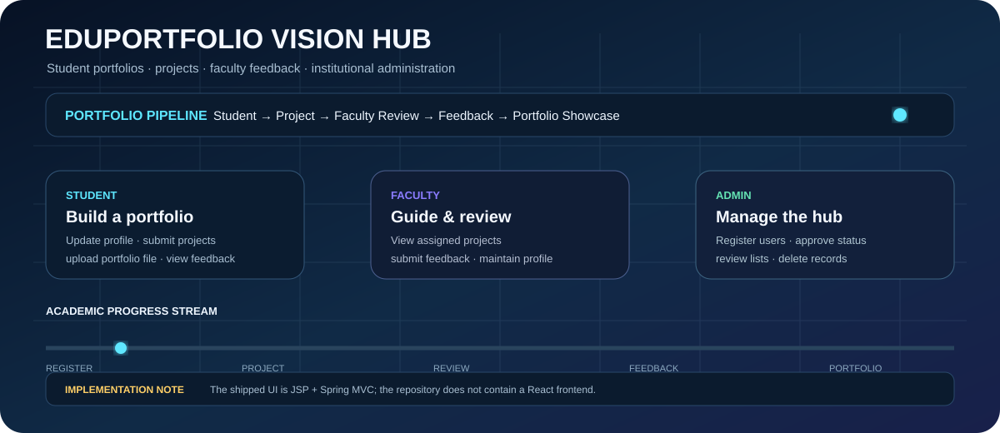
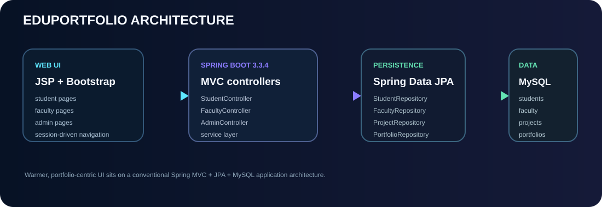

# 🎓 EduPortfolio Vision Hub

**ACADEMIC WORKSPACE · ROLE MATRIX · PROJECT REVIEW**

<table>
<tr>
<td width="60%">

</td>
<td width="40%">

### WHO OWNS WHAT?

| Role | Focus |
|---|---|
| 🎓 Student | project + portfolio |
| 🧑‍🏫 Faculty | review + feedback |
| 🛡️ Admin | users + status |

</td>
</tr>
</table>

> **Implementation note:** the shipped frontend is **JSP + Spring MVC**. There is no React application in the current repository.

---

## 01 · Academic workflow

EduPortfolio Vision Hub is built around three roles and a simple academic-content lifecycle.

### 👨‍🎓 Student

Students can:

- register and log in;
- maintain their profile;
- submit projects with project number, name, description, URL, and selected faculty;
- view their own projects;
- submit a portfolio containing role, skills, and an uploaded file;
- view portfolio records;
- view faculty feedback attached to projects.

### 👩‍🏫 Faculty

Faculty users can:

- register and log in;
- maintain their profile;
- view projects associated with them;
- provide project feedback.

### 🛡️ Admin

Administrators can:

- log in;
- register students and faculty;
- view student/faculty records;
- accept or reject student/faculty status;
- update records;
- delete student/faculty records;
- view portfolio/project information.

## 🔄 Application flow

```text
                 ┌───────────────┐
                 │     ADMIN     │
                 │ register      │
                 │ approve/reject│
                 │ manage users  │
                 └───────┬───────┘
                         │
                         ▼
┌─────────────┐   ┌───────────────┐   ┌─────────────┐
│   STUDENT   │──▶│    PROJECT    │◀──│   FACULTY   │
│             │   │   submission  │   │             │
│ profile     │   │ feedback      │   │ profile     │
│ projects    │   └───────┬───────┘   │ review      │
│ portfolio   │           │            └─────────────┘
└──────┬──────┘           ▼
       │            ┌───────────────┐
       └───────────▶│  PORTFOLIO    │
                    │ role + skills │
                    │ uploaded file │
                    └───────────────┘
```

<p align="center">
  
</p>

## 🧱 Architecture

The current project follows a conventional Spring MVC layering:

| Layer | Implementation |
|---|---|
| Web UI | JSP pages + CSS + Bootstrap-style components |
| Controllers | Student / Faculty / Admin controllers |
| Services | Student / Faculty / Admin / Project / Portfolio services |
| Persistence | Spring Data JPA repositories |
| ORM | Hibernate |
| Database | MySQL |
| Sessions | HttpSession role-specific state |
| Packaging | WAR |
| Runtime | Spring Boot 3.3.4 on Java 21 |

## 🗂️ Domain model

```text
Student
├── profile + credentials
└── status

Faculty
├── profile + credentials
└── status

Project
├── student → ManyToOne
├── faculty → ManyToOne
├── project metadata
└── feedback

Portfolio
├── role
├── skills
└── uploaded file (BLOB)

Admin
├── username
└── password
```

## 📦 Project submission

A student submits:

```text
Project number
      +
Project name
      +
Description
      +
Project URL
      +
Faculty
      ↓
ProjectRepository.save(...)
```

The project stores both student and faculty relationships, allowing faculty users to retrieve faculty-linked projects and leave feedback.

## 📄 Portfolio upload

The student portfolio workflow stores the uploaded file as a database BLOB:

```text
Student
  │
  ├── role
  ├── skills
  └── file upload
         │
         ▼
   java.sql.Blob
         │
         ▼
 portfolio_table
```

The `/displayfile` route reads the BLOB and returns it as `application/pdf`.

## 🔐 Authentication and status flow

The application uses traditional Spring MVC sessions rather than Spring Security.

```text
Credentials
   │
   ▼
Repository login query
   │
   ├── invalid ──▶ Login Failed
   │
   └── valid
        │
        ▼
   status check
        │
   ┌────┴────┐
   │         │
accepted   other
   │         │
   ▼         ▼
session    login page +
created    status message
```

Students and faculty must have an **accepted** status before continuing to their role home pages.

> This is a session-based academic application, not an OAuth2/OpenID Connect security architecture.

## 🛠️ Technology stack

### Backend

- Java 21
- Spring Boot 3.3.4
- Spring MVC
- Spring Data JPA
- Hibernate ORM
- Lombok
- Spring Boot Mail
- WAR packaging

### Frontend

- JSP
- HTML/CSS
- JavaScript
- Bootstrap-style UI
- Server-side rendering

### Database

- MySQL
- JPA entity mapping
- Hibernate schema update mode

### Tooling

- Maven Wrapper
- JUnit / Spring Boot Test
- Eclipse / Spring Tool Suite compatible project

## 📁 Repository structure

```text
EDUPORTFOLIO-VISION-HUB/
├── pom.xml
├── mvnw
├── mvnw.cmd
├── LICENSE
├── README.md
├── assets/
│   ├── eduportfolio-hero.svg
│   ├── eduportfolio-architecture.svg
│   └── eduportfolio-role-flow.svg
│
└── src/
    ├── main/
    │   ├── java/com/klef/jfsd/project/
    │   │   ├── controller/
    │   │   ├── model/
    │   │   ├── repository/
    │   │   └── service/
    │   ├── resources/
    │   │   └── application.properties
    │   └── webapp/
    │       ├── images/
    │       ├── *.jsp
    │       └── style.css
    │
    └── test/
        └── java/com/klef/jfsd/project/
```

## ⚙️ Configuration

The application is configured for MySQL on port 1797:

```properties
spring.application.name=StudentProjectAndPortfolioManagement
server.port=1797

spring.datasource.driver-class-name=com.mysql.cj.jdbc.Driver
spring.datasource.url=jdbc:mysql://localhost:3306/studentprojectandportfoliomanagement
spring.datasource.username=root
spring.datasource.password=root

spring.jpa.hibernate.ddl-auto=update
spring.jpa.show-sql=true
spring.jpa.properties.hibernate.dialect=org.hibernate.dialect.MySQLDialect

spring.mvc.view.prefix=/
spring.mvc.view.suffix=.jsp
```

Before deployment, move database credentials into environment variables or external configuration and avoid committing passwords.

## 🚀 Run locally

### Prerequisites

- JDK 21
- MySQL
- Git
- Optional: Eclipse / Spring Tool Suite / IntelliJ IDEA

### 1. Clone

```bash
git clone https://github.com/Sai-Srinivas-P/EDUPORTFOLIO-VISION-HUB.git
cd EDUPORTFOLIO-VISION-HUB
```

### 2. Create the database

```sql
CREATE DATABASE studentprojectandportfoliomanagement;
```

Then update `src/main/resources/application.properties` with your local MySQL credentials.

### 3. Start the application

Linux / macOS:

```bash
./mvnw spring-boot:run
```

Windows:

```bat
mvnw.cmd spring-boot:run
```

### 4. Open the application

```text
http://localhost:1797/
```

The root route renders `home.jsp`.

## 🧪 Testing

Run:

```bash
./mvnw test
```

The repository currently contains a Spring Boot application-context test. There is not yet comprehensive controller, upload-validation, or end-to-end workflow coverage.

## 🧭 Useful routes

| Feature | Route |
|---|---|
| Home | `/` |
| Student login | `/stulogin` |
| Student home | `/stuhome` |
| Student profile | `/stuprofile` |
| Add project | `/addproject` |
| My projects | `/viewmyprojects` |
| Add portfolio | `/addportfolio` |
| All portfolios | `/viewallportfolios` |
| Faculty login | `/faclogin` |
| Faculty home | `/fachome` |
| Faculty profile | `/facprofile` |
| Faculty projects | `/viewallprojects` |
| Admin login | `/adminlogin` |
| Admin home | `/adminhome` |
| View students | `/viewallstus` |
| View faculty | `/viewallfacs` |

## ⚠️ Current limitations

The previous README described capabilities that are not visible in the current codebase. The project is better characterized as a **Java/Spring academic portfolio-management application**.

Current limitations include:

- no React frontend in the repository;
- no explicit Spring Security configuration;
- direct password storage/querying in the current domain/repository flow;
- HttpSession-based role state;
- database credentials committed in development configuration;
- portfolio BLOB handling with the display endpoint assuming PDF content;
- lightweight automated tests;
- no production-grade migration/secret-management setup.

## 🛣️ Modernization roadmap

```text
Current JSP + Session application
            │
            ▼
Spring Security + password hashing
            │
            ▼
DTO + validation boundaries
            │
            ▼
Upload/content validation
            │
            ▼
Database migrations + secret management
            │
            ▼
REST API + modern frontend
            │
            ▼
Portfolio analytics + notifications
```

The best next improvement is security and data-boundary hardening, not simply adding more screens.

## 🎯 Interview-ready concepts

This repository demonstrates:

**Spring Boot → MVC → dependency injection → service layer → Spring Data JPA → Hibernate → MySQL → JSP → HttpSession → multipart upload → BLOB handling → role-based workflows → CRUD → Maven/WAR packaging**

## 📜 License

MIT License. See [`LICENSE`](LICENSE).

## 👤 Author

**Sai-Srinivas-P**  
GitHub: https://github.com/Sai-Srinivas-P

---

<p align="center">
  <strong>🎓 Build it. Review it. Showcase it.</strong>
  <br/>
  <sub>EduPortfolio Vision Hub connects academic work with structured project and portfolio workflows.</sub>
</p>
